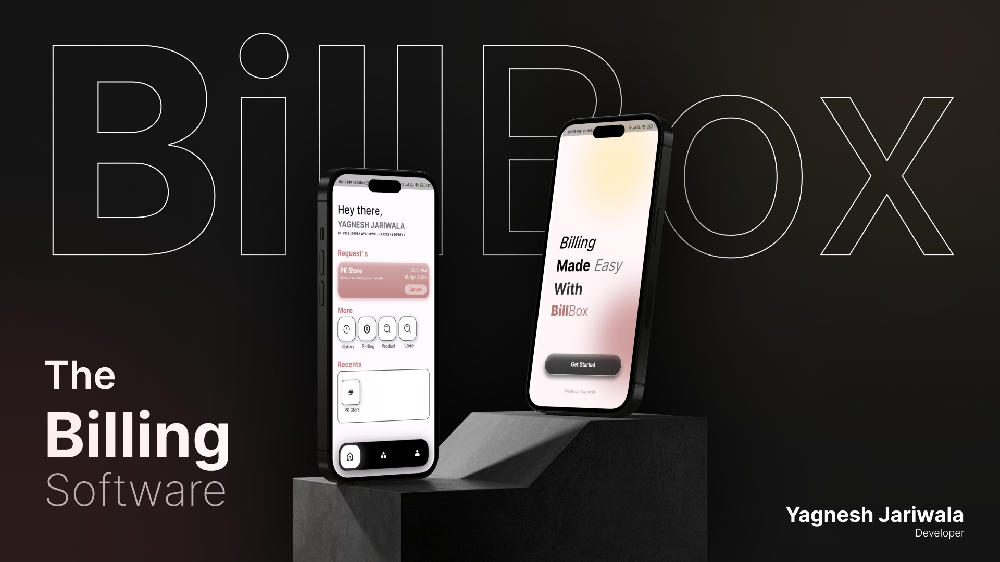

<h1 align="center">Hi 👋, I'm Yagnesh jariwala</h1>
<h3 align="center">A passionate flutter developer from India</h3>

- 🔭 I’m currently working on **Bill Box**

- 🌱 I’m currently learning **react native**

- 👯 I’m looking to collaborate on **takecare**

- 💬 Ask me about **react native or react js**

<h3 align="left">Connect with me:</h3>
<p align="left">
<a href="https://dev.to/yagnesh jariwala" target="blank"></a>
<a href="https://linkedin.com/in/https://www.linkedin.com/in/yagnesh-jariwala-70273128b/" target="blank"></a>
<a href="https://instagram.com/https://www.instagram.com/_yagnesh_jariwala_" target="blank"></a>
</p>

<h3 align="left">Languages and Tools:</h3>
<p align="left"> <a href="https://developer.android.com" target="_blank" rel="noreferrer">  </a> <a href="https://angular.io" target="_blank" rel="noreferrer">  </a> <a href="https://www.arduino.cc/" target="_blank" rel="noreferrer">  </a> <a href="https://www.cprogramming.com/" target="_blank" rel="noreferrer">  </a> <a href="https://www.w3schools.com/cpp/" target="_blank" rel="noreferrer">  </a> <a href="https://www.w3schools.com/css/" target="_blank" rel="noreferrer">  </a> <a href="https://dart.dev" target="_blank" rel="noreferrer">  </a> <a href="https://dotnet.microsoft.com/" target="_blank" rel="noreferrer">  </a> <a href="https://www.figma.com/" target="_blank" rel="noreferrer">  </a> <a href="https://firebase.google.com/" target="_blank" rel="noreferrer">  </a> <a href="https://flutter.dev" target="_blank" rel="noreferrer">  </a> <a href="https://git-scm.com/" target="_blank" rel="noreferrer">  </a> <a href="https://www.w3.org/html/" target="_blank" rel="noreferrer">  </a> <a href="https://www.adobe.com/in/products/illustrator.html" target="_blank" rel="noreferrer">  </a> <a href="https://www.java.com" target="_blank" rel="noreferrer">  </a> <a href="https://developer.mozilla.org/en-US/docs/Web/JavaScript" target="_blank" rel="noreferrer">  </a> <a href="https://kotlinlang.org" target="_blank" rel="noreferrer">  </a> <a href="https://www.linux.org/" target="_blank" rel="noreferrer">  </a> <a href="https://www.mongodb.com/" target="_blank" rel="noreferrer">  </a> <a href="https://www.mysql.com/" target="_blank" rel="noreferrer">  </a> <a href="https://nodejs.org" target="_blank" rel="noreferrer">  </a> <a href="https://www.oracle.com/" target="_blank" rel="noreferrer">  </a> <a href="https://www.photoshop.com/en" target="_blank" rel="noreferrer">  </a> <a href="https://www.php.net" target="_blank" rel="noreferrer">  </a> <a href="https://postman.com" target="_blank" rel="noreferrer">  </a> <a href="https://www.python.org" target="_blank" rel="noreferrer">  </a> <a href="https://reactjs.org/" target="_blank" rel="noreferrer">  </a> <a href="https://reactnative.dev/" target="_blank" rel="noreferrer">  </a> <a href="https://www.selenium.dev" target="_blank" rel="noreferrer">  </a> <a href="https://www.sqlite.org/" target="_blank" rel="noreferrer">  </a> <a href="https://www.tensorflow.org" target="_blank" rel="noreferrer">  </a> <a href="https://www.adobe.com/products/xd.html" target="_blank" rel="noreferrer">  </a> </p>

## 📝 Projects

- [TakeCare](#tc)
- [Billbox](#bb)
- [Dijkstra Algorithm visualizer](#dij)
- [Dear Diary](#dd)
- [attendance using Face recognition](#at)
- [y-Chat](#chat)

---

# ❤️ TakeCare <a name = "tc"></a>

---


Great! If you've created the project in Flutter, the README would need some adjustments to reflect the specific technologies and setup for a Flutter-based project. Here's a modified version for a Flutter project:

## TakeCare - Clinic Appointment Booking System (Flutter)

## Overview

TakeCare is a mobile application developed using Flutter, designed to simplify the process of booking appointments at clinics across India. With TakeCare, users can easily find and schedule appointments with healthcare providers, making it convenient to access medical services on the go.

## Features

- **User-friendly Interface:** The application provides an intuitive and easy-to-use interface, ensuring a seamless experience for users looking to book appointments.

- **Search and Discover Clinics:** Users can search for clinics based on location, specialty, or specific healthcare providers, allowing them to find the right healthcare services that meet their needs.

- **Appointment Booking:** TakeCare allows users to book appointments with just a few taps. Users can select the date and time that suits them best, reducing waiting times at the clinic.

- **User Accounts:** Registered users can create accounts to manage their appointments, view past bookings, and receive notifications about upcoming appointments.

## Technologies Used

- **Flutter:** UI toolkit for building natively compiled applications for mobile, web, and desktop from a single codebase.
- **Dart:** Programming language optimized for building mobile, desktop, server, and web applications.

## Acknowledgments

- Special thanks to the contributors who have dedicated their time and effort to make TakeCare a valuable resource for users seeking healthcare services.

Feel free to reach out if you have any questions or concerns. Happy coding!

---

# 👨‍💻 BillBox <a name = "bb"></a>

---



<h3 align="center"> Bill management system</h3>

<div align="center">

[]()
[](https://github.com/kylelobo/The-Documentation-Compendium/issues)
[](https://github.com/kylelobo/The-Documentation-Compendium/pulls)
[](/LICENSE)

</div>

---

<p align="center"> PaperLess billing history by any Store
    <br> 
</p>

## 🧐 About <a name = "about"></a>

BillBox is an innovative billing system designed to streamline the process of generating and managing bills for small-scale businesses. With its intuitive Android and desktop applications, BillBox offers users a convenient platform to create, view, and organize online bills effortlessly.

## 🎈 Usage <a name="usage"></a>

This Application use to view bill history with paper less solution.

## ⛏️ Built Using <a name = "built_using"></a>

- [Firebase](https://www.mongodb.com/) - Database
- [Flutter](https://nodejs.org/en/) - Frontend
- [Dart](https://nodejs.org/en/) - Backend

## ✍️ Authors <a name = "authors"></a>

- [@YagneshJariwala](https://www.linkedin.com/in/yagnesh-jariwala-70273128b/) - Linkedin

---

# 📔 Dear Diary <a name = "dd"></a>

---

<p align="center"> Create a note for own..
    <br> 
</p>

## Example


## 🏁 Getting Started <a name = "getting_started"></a>

### Powershell

What things you need to install the software and how to install them.

```
git clone https://github.com/yagnesh0312/dear_diary_desktop.git
```

### Installing

This project is build in flutter you need to install flutter

## 🎈 Usage <a name="usage"></a>

## You create diary for own purpose

# 🗺️ Dijkstra Visualizern<a name = "dij"></a>

---

<div align="center">

[]()
[](https://www.reddit.com/user/Wordbook_Bot)
[](https://github.com/kylelobo/The-Documentation-Compendium/issues)
[](https://github.com/kylelobo/The-Documentation-Compendium/pulls)
[](/LICENSE)

</div>

---

<p align="center"> 🤖 
    <br> 
</p>

## 🧐 About <a name = "about"></a>

Dijkstra's algorithm efficiently finds the shortest path from a source node to all other nodes in a graph with non-negative edge weights, using a priority queue to greedily select the next node with the smallest tentative distance. It terminates when all nodes have been visited, providing the shortest paths and distances.

## 🎥 Demo <a name = "demo"></a>


## 💭 How it works <a name = "working"></a>

Dijkstra's algorithm is a graph algorithm that finds the shortest path between two nodes in a graph. It works by maintaining a set of nodes that have been visited, and a set of nodes that have not been visited. The algorithm repeatedly expands the set of visited nodes by choosing the node with the lowest cost, and adding its neighbors to the set of visited nodes. The algorithm terminates when the destination node is reached.

## 🏁 Getting Started <a name = "getting_started"></a>

```
git clone https://github.com/yagnesh0312/find_shortest_path_flutter.git
```

<p align="center">
  
</p>

---

# 💬 Y- Chat <a name = "chat"></a>

---

<div align="center">

[]()
[](https://github.com/kylelobo/The-Documentation-Compendium/issues)
[](https://github.com/kylelobo/The-Documentation-Compendium/pulls)
[](/LICENSE)

</div>

---

<p align="center"> Connect with chat
    <br> 
</p>

## 🧐 About <a name = "about"></a>

Are you tired of cumbersome messaging apps that clutter your screen and complicate your conversations? Say hello to Y Chat, where simplicity meets sophistication, revolutionizing the way you connect with your friends, family, and colleagues.

## 🏁 Screenshots <a name = "getting_started"></a>

<p>


</p>

---

# 😃 Attendance using Face Detection<a name = "at"></a>

---

## Before impiment this project

add dependency

```bash
  pip install opencv-python
  pip install pillow
  pip install numpy
  pip install face_recognition
```

## 🚀 About Me

implement by

- Yagnesh Jariwala
- Vraj Chovatiya

## Authors

- [@yagneshJariwala](https://github.com/yagnesh0312)
- [@vrajChovatiya](https://github.com/vraj-chovatiya)
